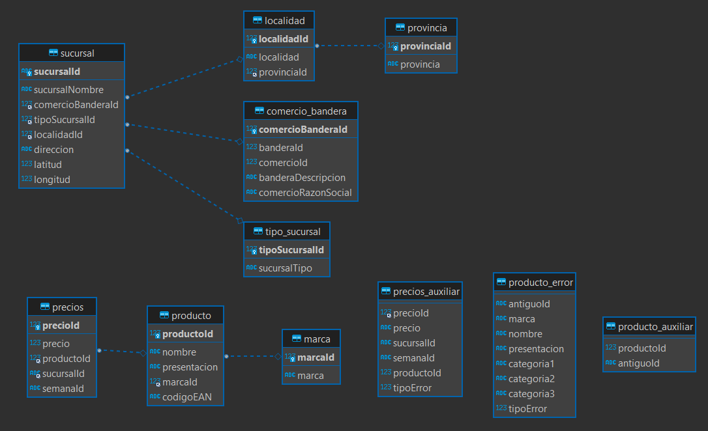
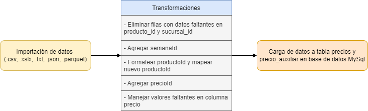

<h1 align="center"> ETL - Proyecto de data engineer :rocket: </h1>

> Repositorio para el proyecto de data engineer del bootcamp Soy Henry.   

[](https://www.gnu.org/licenses/gpl-3.0)

# **Tabla de Contenidos:**

- [El proyecto](#about_project)
- [Sobre el repositorio](#about_repo)
- [Base de datos](#db)
- [Script](#project)
- [License](#license)

# El proyecto <a name="about_project"></a>
El objetivo del proyecto fue hacer un ETL sencillo a partir de un conjunto de datos enfocados en una perspectiva de negocios.

# Sobre el repositorio <a name="about_repo"></a>

En el repositorio se encuentra un script sencillo para hacer la importación, limpieza y carga de los datos en una base de datos previamente armada y normalizada.

Los datos para armar la base de datos se limpiaron con `clean-database.py`. La carpeta database contiene un archivo zip que se puede descomprimir en el root de MySql para tener le database armado. Tambien se encuentra un script para hacer las conexiones.

# Base de datos <a name="db"></a>
Se armó la siguiente base de datos:

<p align="center">
  
</p>

*Nota*: la conexión entre precio y sucursal no se hizo porque hay una cantidad considerable de entradas sin dato en la tabla precios. Eliminarlos queda a juicio del que utilice la base de datos.

# Script <a name="project"></a>
> Script para importación, limpieza y carga de datos.
## Pipeline
El pipeline funciona con los datos de precio_semana proporcionados para el proyecto, que se pueden encontrar en [este link]([lhco2020.github.io/homepage/](https://drive.google.com/drive/folders/1Rsq-HHomPtQwy7RIWQ574wKcf56LiGq1)).

Los archivos que utiliza el pipeline deben tener el nombre estructurado como: 'precios_semana_20201203.csv', donde la extension puede ser .csv, .xlsx, .json, .txt y .parquet. En caso de ser .xlsx solo debe tener información en un sheet. El archivo debe tener las siguientes columnas:

```
    precio: Precio del producto en pesos argentinos.
    producto_id: Código EAN del producto.
    sucursal_id: ID de la sucursal. Los dos primeros números determinan la cadena.
```

El script procesa los datos siguiendo los pasos a continuación:
- **Entrada**: archivo con las columnas precio, producto_id y sucursal_id.
- **Pasos**
1. Importar los datos
2. Normalizar los datos, que incluye:
   - Agregar precioId y semanaId
   - Formatear productoId y sucursalId
   - Manejo de nulos
3. Cargar los datos en la tabla de precios y los datos erroneos en la tabla de precios_auxiliar.
- **Output**: Resultado del query que calcula el precio promedio de la sucursal 9-1-688

Un diagrama con los pasos anteriores se muestra a continuación,

<p align="center">
  
</p>

## Correr el pipeline 
El script se puede correr desde el terminal. Las opciones para correrlo son:
```
    run.py --help
```
Output:
```
    usage: run.py [-h] [--archivo ARCHIVO] [--db DB] [--sep SEP]

    Opciones para correr el script

    optional arguments:
    -h, --help         show this help message and exit
    --archivo ARCHIVO  Nombre del archivo a procesar y agregar. Ej: precios_semana_20201123.csv
    --db DB            Nombre de la base de datos. Default: ETL_project
    --sep SEP          Separador del archivo
```
## Datos
Para armar el database y correr el pipeline hay que descargar los datos en [este link]([lhco2020.github.io/homepage/](https://drive.google.com/drive/folders/1Rsq-HHomPtQwy7RIWQ574wKcf56LiGq1)) y ponerlos en la carpeta `datasets`.
# Licencia <a name="license"></a>

El uso de este trabajo está licenciado bajo [GNU General Public License v3.0 (GNU GPLv3)](https://choosealicense.com/licenses/gpl-3.0/)
